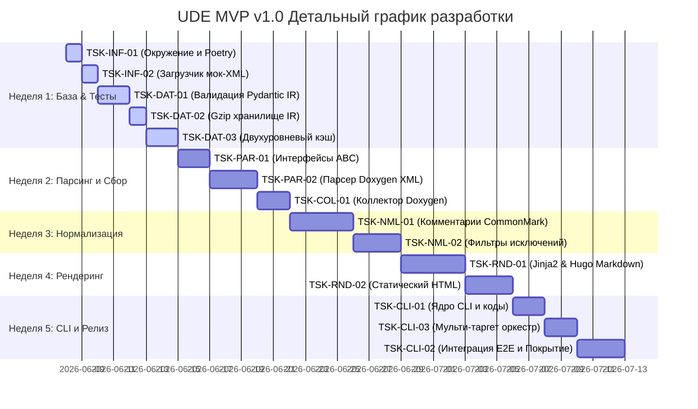

# План реализации MVP — Universal Documentation Engine (UDE)

Этот документ представляет собой пошаговый план разработки ядра **Universal Documentation Engine (UDE)**. План строго синхронизирован с физическими спецификациями задач в папке `.antigravitycli/tasks/` и проектной документацией.

Разработка ведётся по методологии **TDD (Test-Driven Development)**:
1. **RED**: Пишем падающие тесты под интерфейс и требования.
2. **GREEN**: Пишем минимальный рабочий код для прохождения тестов.
3. **REFACTOR**: Рефакторим, чистим код, поддерживая покрытие тестов `>= 90%`.

---

## 🗓️ Еженедельный график реализации (5 недель)

---

## 🎯 Спецификация задач по этапам

### 📍 Неделя 1: Тестовое окружение и структуры хранения данных
1. **`TSK-INF-01` (Инициализация Poetry и pytest)**
   * *Цель*: Настройка окружения Python в подмодуле `engine/`, создание `pyproject.toml`, установка зависимостей (`pydantic>=2.0`, `jinja2`, `lxml`, `pytest`, `pytest-cov`, `black`).
   * *Критерий успеха*: `pytest` успешно импортирует пустой модуль `ude` и проходит тест версии `__version__ = "0.1.0"`.
2. **`TSK-INF-02` (Загрузчик мок-XML ассетов для тестов)**
   * *Цель*: Создание класса `MockAssetLoader` в `tests/utils.py` и подготовка файлов `index.xml`, `class_definition.xml` для тестов.
   * *Критерий успеха*: Тесты загружают тестовые XML как строки без хардкода путей.
3. **`TSK-DAT-01` (Валидация схем Pydantic IR)**
   * *Цель*: Разработка схем `ProjectCatalog`, `NamespaceEntity`, `ClassEntity`, `MethodEntity`, `ParameterField` в `ude/models.py`.
   * *Критерий успеха*: Тесты верифицируют успешную валидацию валидных структур и корректные ошибки валидации для неверных типов.
4. **`TSK-DAT-02` (Компрессия Gzip и прозрачный ввод-вывод)**
   * *Цель*: Функции `save_compressed_ir` and `load_compressed_ir` в `ude/storage.py` для сериализации/десериализации Pydantic-моделей в `.json.gz`.
   * *Критерий успеха*: Тесты записывают и читают сжатые файлы, гарантируя 100% бинарную идентичность восстановленных объектов.
5. **`TSK-DAT-03` (Двухуровневый инкрементальный кэш сборки)**
   * *Цель*: Разработка `BuildCacheManager`. Кэш парсинга (уровня 1) пропускает чтение неизмененных XML (проверка `mtime` и хэша), кэш рендеринга (уровня 2) пропускает физическую запись файлов, если сигнатуры сущностей и шаблоны не изменились.
   * *Критерий успеха*: Повторный запуск сборки выполняется за 0 I/O операций перезаписи.

### 📍 Неделя 2: Абстрактные контракты и сбор Doxygen XML
6. **`TSK-PAR-01` (Интерфейсы BaseParser и BaseRenderer)**
   * *Цель*: Создание абстрактных классов (`BaseParser`, `BaseRenderer`) и иерархии исключений (`UdeException`, `ParserError`, `RendererError`) в `ude/interfaces.py`.
   * *Критерий успеха*: Попытка инстанцировать интерфейсы напрямую падает с `TypeError`. Документированность классов через `Satisfies` строки трассировки.
7. **`TSK-PAR-02` (Парсер Doxygen XML)**
   * *Цель*: Класс `DoxygenXmlParser` в `ude/parsers/doxygen.py`. Извлекает структуру C++, C#, Java, Python. Корректно парсит пространства имен `::`, шаблоны `< >`, конструкторы/деструкторы `~`, отсекает экспортные макросы (например, `NWDBEXPORT`) и SWIG-поля (`swigCPtr`, `Dispose()`).
   * *Критерий успеха*: Зеленый статус тестов, парсер преобразует сложные XML в валидный `ProjectCatalog`.
8. **`TSK-COL-01` (Коллектор DoxygenXmlCollector)**
   * *Цель*: Запуск Doxygen из Python подмодулем `subprocess.run`, динамическая генерация `Doxyfile` под язык, валидация окружения (`validate_environment`) и рекурсивная очистка временных папок (`cleanup`) с жёсткими guard clauses (исключения на удаление `/`, `.`, `..`).
   * *Критерий успеха*: Doxygen отрабатывает, возвращает XML-файлы, временные папки удаляются без угроз системным файлам.

### 📍 Неделя 3: Нормализация комментариев и обработка исключений
9. **`TSK-NML-01` (Нормализатор комментариев в CommonMark)**
   * *Цель*: Преобразование Javadoc `@param`/`@return` и Doxygen `\param`/`\return` в чистый Markdown-текст с заполнением метаданных параметров в IR-схеме.
   * *Критерий успеха*: Единый оффлайн-формат Markdown на выходе вне зависимости от исходного стиля документирования в коде.
10. **`TSK-NML-02` (Фильтры исключений и Ignore-теги)**
    * *Цель*: Исключение сущностей, находящихся между тегами `DOM-IGNORE-BEGIN`/`DOM-IGNORE-END`, `@cond`/`@endcond`, а также содержащих `@internal`/`\internal`.
    * *Критерий успеха*: Исключенные сущности полностью отсутствуют в генерируемом `ProjectCatalog`.

### 📍 Неделя 4: Шаблонизация и Рендеринг мульти-форматов
11. **`TSK-RND-01` (Рендерер Hugo Markdown и метаданные Front-Matter)**
    * *Цель*: Класс `HugoMarkdownRenderer` в `ude/renderers/hugo_markdown.py`. Генерация Markdown-файлов с TOML/YAML заголовками (`title`, `sidebar_position`). Автоматическое экранирование угловых скобок `< >` для C++ шаблонов.
    * *Критерий успеха*: Сгенерированные файлы успешно компилируются движком Hugo/Docusaurus без ошибок рендеринга тегов.
12. **`TSK-RND-02` (Прямой компилятор статического HTML)**
    * *Цель*: Класс `HtmlRenderer` в `ude/renderers/static_html.py` на базе шаблонов Jinja2. Генерация полностью автономных HTML-страниц с локальным CSS-оформлением и боковым меню навигации.
    * *Критерий успеха*: Сборка выдает готовый оффлайн-сайт с кросс-ссылками классов.

### 📍 Неделя 5: CLI-интерфейс, Мульти-таргет Оркестрация и Сквозные Тесты
13. **`TSK-CLI-01` (Ядро неинтерактивного CLI)**
    * *Цель*: Создание `ude/cli.py` на базе `argparse`. Поддержка параметров `--config`, `--input`, `--format`, `--output`, а также возврат кода `0` при успехе и `1` при ошибке с выводом в `stderr`.
    * *Критерий успеха*: Полная автоматизация вызовов без диалоговых окон.
14. **`TSK-CLI-03` (Оркестратор UdeOrchestrator)**
    * *Цель*: Класс `UdeOrchestrator` в `ude/orchestrator.py`. Читает децентрализованный `ude_config.json`, разрешает все относительные пути относительно расположения файла настроек, запускает коллектор ➡️ парсер ➡️ рендерер, обрабатывает `error_policy`.
    * *Критерий успеха*: Оркестратор запускается корректно из любой CWD-папки (полная портативность путей).
15. **`TSK-CLI-02` (Интеграционные тесты E2E и покрытие >= 90%)**
    * *Цель*: Сквозной тест `tests/test_integration_pipeline.py`. Проходит весь путь: XML ➡️ IR ➡️ Gzip ➡️ HTML. Наращивание тестов до достижения суммарного покрытия `pytest-cov` `>= 90%`.
    * *Критерий успеха*: Все тесты зеленые, общий процент покрытия кода строго `>= 90%`.

---

## 📈 Критерии качества и приемки MVP
1. **Тестовое покрытие**: pytest-cov показывает `>= 90%`.
2. **Скорость работы**: Обработка 1000 API-классов занимает `< 5 секунд`.
3. **Чистота Git**: Выходные папки сгенерированных страниц никогда не фиксируются в репозитории (100% Git Hygiene).
