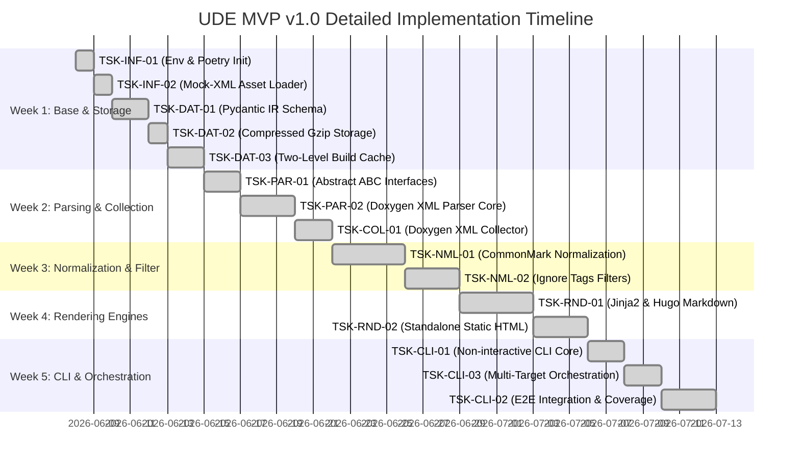

# MVP Implementation Plan — Universal Documentation Engine (UDE)

This document represents the step-by-step development roadmap for the core **Universal Documentation Engine (UDE)**. The plan is strictly synchronized with physical task specifications under `.antigravitycli/tasks/` and our project design documentation.

The development is conducted strictly following the **TDD (Test-Driven Development)** methodology:
1. **RED**: Write failing tests for specified interfaces, requirements, and edge cases.
2. **GREEN**: Implement the minimal, simplest functional code to satisfy and pass the tests.
3. **REFACTOR**: Refactor and clean up code structures while ensuring code coverage remains `>= 90%`.

---

## 🗓️ Weekly Development Schedule (5 Weeks)

---

## 🎯 Task Specifications by Milestones

### 📍 Week 1: Test Environment & Structured Persistence
1. **`TSK-INF-01` (Poetry Init & pytest Harness)** [COMPLETED]
   * *Goal*: Set up Python environment under the `engine/` submodule folder, create `pyproject.toml`, and install dependencies (`pydantic>=2.0`, `jinja2`, `lxml`, `pytest`, `pytest-cov`, `black`).
   * *Success Criterion*: `pytest` successfully imports empty module `ude` and passes a basic version assert check (`__version__ == "0.1.0"`).
2. **`TSK-INF-02` (Mock-XML Asset Loader for Unit Tests)** [COMPLETED]
   * *Goal*: Create helper class `MockAssetLoader` in `tests/utils.py` and prepare test resources like `index.xml` and `class_definition.xml`.
   * *Success Criterion*: Unit tests load target XML assets as strings dynamically without hardcoded filesytem paths.
3. **`TSK-DAT-01` (Pydantic IR Schema Validation)** [COMPLETED]
   * *Goal*: Implement schemas: `ProjectCatalog`, `NamespaceEntity`, `ClassEntity`, `MethodEntity`, `ParameterField` under `ude/models.py`.
   * *Success Criterion*: Tests assert correct parsing of valid structures and proper validation errors for incorrect datatypes.
4. **`TSK-DAT-02` (Gzip Compression & Transparent Stream I/O)** [COMPLETED]
   * *Goal*: Develop `save_compressed_ir` and `load_compressed_ir` inside `ude/storage.py` to serialize/deserialize Pydantic models into Gzip-compressed `.json.gz` formats.
   * *Success Criterion*: Tests verify that compressed binary files are read and written with 100% data integrity compared to their memory equivalents.
5. **`TSK-DAT-03` (Two-Level Incremental Build Cache Manager)** [COMPLETED]
   * *Goal*: Develop `BuildCacheManager`. L1 Parsing Cache skips processing unchanged XML files (validating file size/mtime and content checksums). L2 Rendering Cache skips writing final output documents if entity signatures and Jinja2 templates remain unaltered.
   * *Success Criterion*: Sequential builds execute with zero redundant file write (I/O) operations.

### 📍 Week 2: Abstract Contracts & Doxygen XML Collection
6. **`TSK-PAR-01` (Abstract Class Contracts BaseParser & BaseRenderer)** [COMPLETED]
   * *Goal*: Set up interface definitions (`BaseParser`, `BaseRenderer`) and exception hierarchies (`UdeException`, `ParserError`, `RendererError`) under `ude/interfaces.py`.
   * *Success Criterion*: Direct instantiation attempts of abstract interfaces raise `TypeError`. Classes are fully documented utilizing `Satisfies` tracing comments.
7. **`TSK-PAR-02` (Doxygen XML Parsing Engine)** [COMPLETED]
   * *Goal*: Build `DoxygenXmlParser` in `ude/parsers/doxygen.py` capable of analyzing structures from C++, C#, Java, and Python. Must parse nested namespaces `::`, templates `< >`, constructors `~`, filter export macros (e.g. `NWDBEXPORT`), and omit SWIG wrapper fields (`swigCPtr`, `Dispose()`).
   * *Success Criterion*: Unit tests verify accurate extraction of complex class XML maps into a clean `ProjectCatalog`.
8. **`TSK-COL-01` (Doxygen Process Collector)** [COMPLETED]
   * *Goal*: Invoke Doxygen process via Python's `subprocess.run`, generate localized `Doxyfile` configurations dynamically, validate path environments (`validate_environment`), and recursively prune intermediate folders (`cleanup`) with strict guard rails (raising exceptions if attempting to delete `/`, `.`, or `..`).
   * *Success Criterion*: Doxygen execution returns XML documents, and temporary files are fully cleaned up without security risks to other filesystem paths.

### 📍 Week 3: Comment Normalization & Exclusion Tag Gating
9. **`TSK-NML-01` (Docstring Normalizer to CommonMark)** [COMPLETED]
   * *Goal*: Convert Javadoc-style (`@param`/`@return`) and Doxygen-style (`\param`/`\return`) docstring layouts to clean Markdown, populating parameter metadata tables in the IR.
   * *Success Criterion*: Homogeneous, clean Markdown output regardless of original raw commenting styles in source files.
10. **`TSK-NML-02` (Exclusion Tag and Ignore Filters)** [COMPLETED]
    * *Goal*: Implement structural filtering of classes and members enclosed within `DOM-IGNORE-BEGIN`/`DOM-IGNORE-END`, `@cond`/`@endcond`, or annotated with `@internal`/`\internal` tags.
    * *Success Criterion*: Excluded entities are entirely absent from the generated `ProjectCatalog`.

### 📍 Week 4: Template Customization & Multi-Format Rendering
11. **`TSK-RND-01` (Hugo Markdown Renderer & Front-Matter Metadata)** [COMPLETED]
    * *Goal*: Create `HugoMarkdownRenderer` under `ude/renderers/hugo_markdown.py`. Output pages must contain TOML/YAML front-matter (`title`, `sidebar_position`). Properly escape angle brackets `< >` for C++ templates, and compile logical ToC hierarchies into front-matter metadata headers to enable Hugo menu structure mapping.
    * *Success Criterion*: Generated Markdown compiles cleanly in Hugo or Docusaurus with zero route or tag formatting errors.
12. **`TSK-RND-02` (Standalone Static HTML Compiler)** [COMPLETED]
    * *Goal*: Implement `HtmlRenderer` in `ude/renderers/static_html.py` utilizing localized Jinja2 templates. Generate cohesive, offline-friendly HTML documentation portals equipped with an interactive responsive sidebar (dynamic folder tree collapsing, draggable vertical splitting with local storage retention, and real-time search filtering, loaded via `file:///` protocol without CORS blocks). Implement standardized entity-type page structures (Header badges, metadata panels, Highlight.js prototypes, and collapsible member lists with subtype indicators).
    * *Success Criterion*: Production of an autonomous, cross-linked reference portal accessible directly inside any browser offline.
13. **`TSK-RND-03` (Sidebar Navigation Refactoring & Namespace Landing Pages)** [COMPLETED]
    * *Goal*: Refactor the standalone HTML compiler sidebar tree to eliminate pageless category folders and implement dedicated index landing pages for all logical namespaces (`REQ-FUN-32`, `REQ-FUN-35`).
    * *Success Criterion*: Redundant `Classes` folders are removed, and collapsible sidebar elements collapse or expand dynamically, resolving to valid target namespace landing pages.

### 📍 Week 5: Command Line Interface & E2E Orchestration
13. **`TSK-CLI-01` (Non-Interactive CLI Command Processor)** [COMPLETED]
    * *Goal*: Build `ude/cli.py` on top of `argparse`. Expose parameter switches: `--config`, `--input`, `--format`, `--output`. Return system exit code `0` on success, and custom non-zero codes (like `1` or `2`) on standard failures, logging messages to `stderr`.
    * *Success Criterion*: Seamless, non-interactive execution inside automated scripts with zero prompt dialog blockers.
14. **`TSK-CLI-03` (Multi-Target Orchestration Engine)** [COMPLETED]
    * *Goal*: Build `UdeOrchestrator` in `ude/orchestrator.py`. Parse decentral `ude_config.json` templates, resolve relative paths relative to the config file's physical parent directory, execute the pipeline chain (collector ➡️ parser ➡️ renderer), and enforce custom error policies.
    * *Success Criterion*: Seamless operation regardless of execution's Current Working Directory (CWD) - verifying path portability.
15. **`TSK-CLI-02` (E2E Integration Testing & Coverage Verification)** [COMPLETED]
    * *Goal*: Create a comprehensive integration script `tests/test_integration_pipeline.py`. Run a full E2E lifecycle (XML ➡️ IR ➡️ Gzip ➡️ HTML) and write targeted unit tests until total statement coverage reaches `>= 90%`.
    * *Success Criterion*: All automated tests pass successfully, and `pytest-cov` reports a total statement coverage of `>= 90%`.

---

## 📈 Quality Gates and Acceptance Criteria
1. **Test Coverage**: statement coverage verified by `pytest-cov` is `>= 90%`.
2. **Execution Speed**: Compiling 1,000 API-classes takes `< 5 seconds`.
3. **Git Hygiene**: Output generated files must never be committed to active source control repositories (100% clean Git). All 11 projects output strictly to the unified, root-level `ude_output` directory which is kept out of source control.
