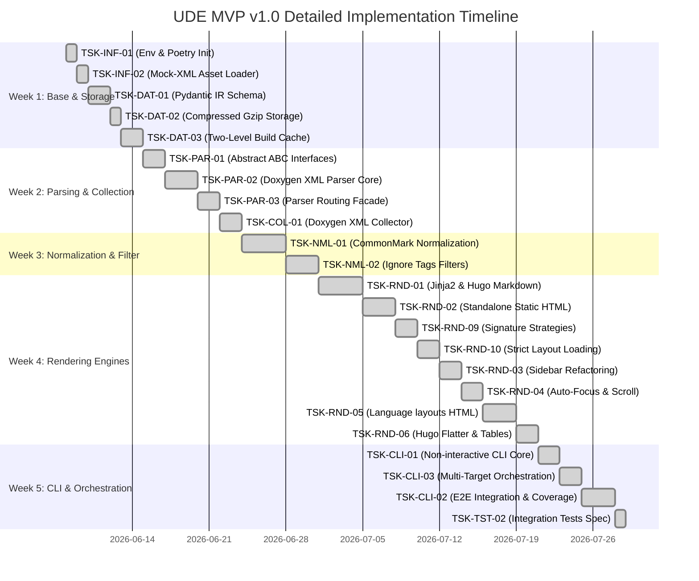

# MVP Implementation Plan — Universal Documentation Engine (UDE)

This document represents the step-by-step development roadmap for the core **Universal Documentation Engine (UDE)**. The plan is strictly synchronized with physical task specifications under `.antigravitycli/tasks/` and our project design documentation.

The development is conducted strictly following the **TDD (Test-Driven Development)** methodology:
1. **RED**: Write failing tests for specified interfaces, requirements, and edge cases.
2. **GREEN**: Implement the minimal, simplest functional code to satisfy and pass the tests.
3. **REFACTOR**: Refactor and clean up code structures while ensuring code coverage remains `>= 98%`.

---

## 🗓️ Weekly Development Schedule (5 Weeks)

---

## 🎯 Task Specifications by Milestones

### 📍 Week 1: Test Environment & Structured Persistence
1. **`TSK-INF-01` (Poetry Init & pytest Harness)** [COMPLETED]
   * *Goal*: Set up Python environment under the `engine/` submodule folder, create `pyproject.toml`, and install dependencies (`pydantic>=2.0`, `jinja2`, `lxml`, `pytest`, `pytest-cov`, `black`).
   * *Success Criterion*: `pytest` successfully imports empty module `ude` and passes a basic version assert check (`__version__ == "0.1.0"`).
2. **`TSK-INF-02` (Mock-XML Asset Loader for Unit Tests)** [COMPLETED]
   * *Goal*: Create helper class `MockAssetLoader` in `tests/utils.py` and prepare test resources like `index.xml` and `class_definition.xml`.
   * *Success Criterion*: Unit tests load target XML assets as strings dynamically without hardcoded filesytem paths.
3. **`TSK-DAT-01` (Pydantic IR Schema Validation)** [COMPLETED]
   * *Goal*: Implement schemas: `ProjectCatalog`, `NamespaceEntity`, `ClassEntity`, `MethodEntity`, `ParameterField` under `ude/models.py`.
   * *Success Criterion*: Tests assert correct parsing of valid structures and proper validation errors for incorrect datatypes.
4. **`TSK-DAT-02` (Gzip Compression & Transparent Stream I/O)** [COMPLETED]
   * *Goal*: Develop `save_compressed_ir` and `load_compressed_ir` inside `ude/storage.py` to serialize/deserialize Pydantic models into Gzip-compressed `.json.gz` formats.
   * *Success Criterion*: Tests verify that compressed binary files are read and written with 100% data integrity compared to their memory equivalents.
5. **`TSK-DAT-03` (Two-Level Incremental Build Cache Manager)** [COMPLETED]
   * *Goal*: Develop `BuildCacheManager`. L1 Parsing Cache skips processing unchanged XML files (validating file size/mtime and content checksums). L2 Rendering Cache skips writing final output documents if entity signatures and Jinja2 templates remain unaltered.
   * *Success Criterion*: Sequential builds execute with zero redundant file write (I/O) operations.

### 📍 Week 2: Abstract Contracts & Doxygen XML Collection
6. **`TSK-PAR-01` (Abstract Class Contracts BaseParser & BaseRenderer)** [COMPLETED]
   * *Goal*: Set up interface definitions (`BaseParser`, `BaseRenderer`) and exception hierarchies (`UdeException`, `ParserError`, `RendererError`) under `ude/interfaces.py`.
   * *Success Criterion*: Direct instantiation attempts of abstract interfaces raise `TypeError`. Classes are fully documented utilizing `Satisfies` tracing comments.
7. **`TSK-PAR-02` (Doxygen XML Parsing Engine)** [COMPLETED]
   * *Goal*: Build `DoxygenXmlParser` in `ude/parsers/doxygen.py` capable of analyzing structures from C++, C#, Java, and Python. Must parse nested namespaces `::`, templates `< >`, constructors `~`, filter export macros (e.g. `NWDBEXPORT`), and omit SWIG wrapper fields (`swigCPtr`, `Dispose()`).
   * *Success Criterion*: Unit tests verify accurate extraction of complex class XML maps into a clean `ProjectCatalog`.
8. **`TSK-PAR-03` (Backward-Compatible Multi-Language Parser Facade)** [COMPLETED]
   * *Goal*: Subclass `DoxygenXmlParser` from `BaseDoxygenParser` to form a routing Facade pattern. Dynamically delegate parsing to concrete language-specific parser subclasses, supporting dynamic auto-detection of programming languages while maintaining complete backward compatibility.
   * *Success Criterion*: Unit tests verify proper routing and fallback auto-detection under `ude.parsers.doxygen`.
9. **`TSK-COL-01` (Doxygen Process Collector)** [COMPLETED]
   * *Goal*: Invoke Doxygen process via Python's `subprocess.run`, generate localized `Doxyfile` configurations dynamically, validate path environments (`validate_environment`), and recursively prune intermediate folders (`cleanup`) with strict guard rails (raising exceptions if attempting to delete `/`, `.`, or `..`).
   * *Success Criterion*: Doxygen execution returns XML documents, and temporary files are fully cleaned up without security risks to other filesystem paths.

### 📍 Week 3: Comment Normalization & Exclusion Tag Gating
9. **`TSK-NML-01`** (Docstring Normalizer to CommonMark) [COMPLETED]
   * *Goal*: Convert Javadoc-style (`@param`/`@return`), Doxygen-style (`\param`/`\return`), and Sphinx/RST-style (`:param`/`:type`/`:return`/`:rtype`) docstring layouts to clean Markdown, populating parameter metadata tables and merging types in the IR.
   * *Success Criterion*: Homogeneous, clean Markdown output regardless of original raw commenting styles in source files, with mapped parameter/return types.
10. **`TSK-NML-02` (Exclusion Tag and Ignore Filters)** [COMPLETED]
    * *Goal*: Implement structural filtering of classes and members enclosed within `DOM-IGNORE-BEGIN`/`DOM-IGNORE-END`, `@cond`/`@endcond`, or annotated with `@internal`/`\internal` tags.
    * *Success Criterion*: Excluded entities are entirely absent from the generated `ProjectCatalog`.

### 📍 Week 4: Template Customization & Multi-Format Rendering
11. **`TSK-RND-01` (Hugo Markdown Renderer & Front-Matter Metadata)** [COMPLETED]
    * *Goal*: Create `HugoMarkdownRenderer` under `ude/renderers/hugo_markdown.py`. Output pages must contain TOML/YAML front-matter (`title`, `sidebar_position`). Properly escape angle brackets `< >` for C++ templates, and compile logical ToC hierarchies into front-matter metadata headers to enable Hugo menu structure mapping.
    * *Success Criterion*: Generated Markdown compiles cleanly in Hugo or Docusaurus with zero route or tag formatting errors.
12. **`TSK-RND-02` (Standalone Static HTML Compiler)** [COMPLETED]
    * *Goal*: Implement `HtmlRenderer` in `ude/renderers/static_html.py` utilizing localized Jinja2 templates. Generate cohesive, offline-friendly HTML documentation portals equipped with an interactive responsive sidebar (dynamic folder tree collapsing, draggable vertical splitting with local storage retention, and real-time search filtering, loaded via `file:///` protocol without CORS blocks). Implement standardized entity-type page structures (Header badges, metadata panels, Highlight.js prototypes, and collapsible member lists with subtype indicators).
    * *Success Criterion*: Production of an autonomous, cross-linked reference portal accessible directly inside any browser offline.
13. **`TSK-RND-09` (Language-Specific Signature Formatting Strategy)** [COMPLETED]
    * *Goal*: Implement an extensible Strategy Pattern to handle formatting of code declarations, namespace structures, scopes, and names tailored to target programming languages (C++, C#, Java, Python).
    * *Success Criterion*: Formatters output exact language-compliant declarations, and scope delimiters (`::` for C++, `.` for other languages) are dynamically resolved.
14. **`TSK-RND-10` (Strict Layout Template Existence Policy)** [COMPLETED]
    * *Goal*: Enforce strict pipeline validation where physical layout templates must exist on disk. Under the fail-fast standard, any absence of templates must immediately halt compilation and raise an explicit `RendererError`.
    * *Success Criterion*: Render process crashes with `RendererError("Layout template not found: ...")` when templates are missing from disk, ensuring immediate visual regression detection.
15. **`TSK-RND-03` (Sidebar Navigation Refactoring & Namespace Landing Pages)** [COMPLETED]
    * *Goal*: Refactor the standalone HTML compiler sidebar tree to eliminate pageless category folders and implement dedicated index landing pages for all logical namespaces (`REQ-FUN-32`, `REQ-FUN-35`).
    * *Success Criterion*: Redundant `Classes` folders are removed, and collapsible sidebar elements collapse or expand dynamically, resolving to valid target namespace landing pages.
16. **`TSK-RND-04` (Sidebar Active Node Auto-Focus & Scroll-Top Alignment)** [COMPLETED]
    * *Goal*: Implement dynamic navigation item auto-focus and vertical scrolling on page load for both offline HTML help (`sidebar.js`) and Hugo templates (`single.html`) according to `REQ-FUN-31`.
    * *Success Criterion*: The active item expands parent categories and is positioned as high as possible inside the visible sidebar viewport on page load.
17. **`TSK-RND-05` (Language-Specific Entity Layouts & Content Refinement)** [COMPLETED]
    * *Goal*: Implement dynamic, language-specific entity layouts inside the static HTML reference generation engine to fully satisfy the visual representation guidelines (`REQ-FUN-32` and `REQ-FUN-35`). Group namespace classes dynamically into non-empty virtual folders (e.g., Classes, Structures, Interfaces, Exceptions) and prune empty folders on-the-fly, redirecting folder URLs to avoid dead links.
    * *Success Criterion*: Standalone reference sites are fully generated with correct delimiter characters (`::` vs `.`), language syntax keywords in code prototypes, sorted folders, and perfect navigation hierarchies.
18. **`TSK-RND-06` (Hugo Nested Sidebar & Namespace Index Tables)** [COMPLETED]
    * *Goal*: Refactor the Hugo markdown generator to support matching nested sidebar navigation (aligning physical and logical folder tree with HTMLRenderer) and dynamically compile Markdown index landing pages for each Namespace containing classes tables (`REQ-FUN-35`), ensuring on-the-fly pruning of empty folders.
    * *Success Criterion*: Physical markdown pages are outputted to virtual subfolders (Classes, Structs, etc.) under namespace directories based on language JSON files, empty folders are pruned, and parent _index.md files are dynamically created.
19. **`TSK-RND-07` (Hugo Sidebar Category Clicking & Path Validation)** [COMPLETED]
    * *Goal*: Resolve Hugo compiled sidebar folder click navigation issues, fix footer layout links pointing to deleted blueprint file, and resolve relative path leakage in parent index pages.
    * *Success Criterion*: Sidebar folder nodes resolve to correct index landing pages, and the link-checker report outputs zero broken internal or external references.

### 📍 Week 5: Command Line Interface & E2E Orchestration
13. **`TSK-CLI-01` (Non-Interactive CLI Command Processor)** [COMPLETED]
    * *Goal*: Build `ude/cli.py` on top of `argparse`. Expose parameter switches: `--config`, `--input`, `--format`, `--output`. Return system exit code `0` on success, and custom non-zero codes (like `1` or `2`) on standard failures, logging messages to `stderr`.
    * *Success Criterion*: Seamless, non-interactive execution inside automated scripts with zero prompt dialog blockers.
14. **`TSK-CLI-03` (Multi-Target Orchestration Engine)** [COMPLETED]
    * *Goal*: Build `UdeOrchestrator` in `ude/orchestrator.py`. Parse decentral `ude_config.json` templates, resolve relative paths relative to the config file's physical parent directory, execute the pipeline chain (collector ➡️ parser ➡️ renderer), and enforce custom error policies.
    * *Success Criterion*: Seamless operation regardless of execution's Current Working Directory (CWD) - verifying path portability.
15. **`TSK-CLI-02` (E2E Integration Testing & Coverage Verification)** [COMPLETED]
    * *Goal*: Create a comprehensive integration script `tests/test_integration_pipeline.py`. Run a full E2E lifecycle (XML ➡️ IR ➡️ Gzip ➡️ HTML) and write targeted unit tests until total statement coverage reaches `>= 98%`.
    * *Success Criterion*: All automated tests pass successfully, and `pytest-cov` reports a total statement coverage of `>= 98%`.
16. **`TSK-RND-08` (Topic/Entity Title Standardization)** [COMPLETED]
    * *Goal*: Standardize the naming of entities (namespaces, classes, structs, etc.) across both `HtmlRenderer` and `HugoMarkdownRenderer` to follow the format `<EntityID> <EntityType>`, ensuring perfect synchronization between sidebar, breadcrumbs, and content header elements.
    * *Success Criterion*: Sidebar navigation labels, page HTML titles, breadcrumbs, and the main page headers are identical and formatted as "<EntityID> <EntityType>". All 163 integration and unit tests pass successfully.
17. **`TSK-TST-01` (Golden Master Regression Testing Baseline)** [COMPLETED]
    * *Goal*: Create a portable, automatic 3-tier regression test suite in `Tests/` with Gzipped intermediate representations and support for both HTML and Hugo Markdown outputs across FacetModeler and BimNv.
    * *Success Criterion*: Automated runs via `Tests/run_regression_tests.py` pass with 100% success (8 PASSED, 0 FAILED) on the baseline. Note: The baseline folder `Tests/baseline/` is untracked from Git (ignored in `.gitignore`) to prevent repository bloat on GitHub.
18. **`TSK-RND-11` (Global Navigation Flat Refactoring & Fields/Structures/Enums Merging)** [COMPLETED]
    * *Goal*: Refactor the standalone HTML compiler and Hugo markdown generator to flat-render global-scope entities at the root of the sidebar, remove the Global Namespace landing page, merge variable fields, structures, and enums into a single combined folder named "Fields, Structures and Enums", and ensure actual namespaces sort first.
    * *Success Criterion*: Sidebar has namespaces first, then global entity folders in exact order: Classes, Fields, Structures and Enums, Functions, Types. The Global Namespace page is skipped entirely during build, and both HTML and Hugo renderers generate identical hierarchies.
19. **`TSK-TST-02` (Integration Tests Specification Document)** [COMPLETED]
    * *Goal*: Specify the 4 post-build integration and artifact verification tests in a dedicated document inside `design-docs` and link them relatively from the requirements specifications.
    * *Success Criterion*: The integration specification is written to `design-docs/docs/srs/integration_tests_specification.md`, and all references in `functional.md` and `quality_audit.md` are relative and successfully validated.

---

## 📈 Quality Gates and Acceptance Criteria
1. **Test Coverage**: statement coverage verified by `pytest-cov` is `>= 98%`.
2. **Execution Speed**: Compiling 1,000 API-classes takes `< 5 seconds`.
3. **Git Hygiene**: Output generated files must never be committed to active source control repositories (100% clean Git). All 11 projects output strictly to the unified, root-level `ude_output` directory which is kept out of source control.

## 🧪 Дополнения к доработке тестовой инфраструктуры (Addenda)
1. **Docomatic Comparison Count Header**: Тест сравнения Docomatic и UDE должен автоматически вычислять общее количество отклонений и записывать его в начало каждого файла различий JSON под ключом `"total_differences"`.
2. **Golden Master Exception Gating**: Тест золотого стандарта должен на входе принимать список исключений — путей к выходным файлам (`exceptions`). Если расхождения обнаруживаются исключительно в этих файлах, тест не должен падать.
3. **Parameterized Golden Master Complexes**: Тест золотого стандарта должен поддерживать работу с несколькими независимыми наборами (комплексами) парсеров и рендереров (например, "modern" и "legacy") с сохранением эталонов в изолированные подкаталоги (`html_legacy`, `markdown_legacy`), предотвращая взаимное перезаписывание.

