# UDE v2.0 — Requirements Summary (Next Release)

**Document ID:** REQ-V2-NEXT  
**Version:** 2.0  
**Status:** Approved — scope finalized, feasibility pre-assessed at roadmap approval  
**Source:** Scope negotiation sessions; derived from `.antigravitycli/v2_execution_plan.md`  
**Traceability scheme:** `GAP-XX` → `TASK-<Phase>.<Group>.<Seq>` (bidirectional)

> **Audit note (2026-06-28):** Feasibility is marked N/A for all items — these are committed
> v2.0 GAP items, pre-assessed at roadmap approval stage per `requirements_audit.md` rules.

---

## Cluster A — Infrastructure (Phase 1)

### REQ-V2-01 · Global Config Field Activation (GAP-09)

**Statement:** All fields in `ude_global_config.json` (`doxygen_path`, `log_level`, `log_file`,
`cache_root_dir`, `global_templates_dir`, `error_policy`) MUST be read, validated via a Pydantic
`GlobalConfig` model, and operationally applied at engine startup. Unknown keys MUST be silently
ignored (`ConfigDict(extra="ignore")`). Backward compatibility: missing fields MUST default
without raising `ValidationError`.

**Acceptance criteria:**
- `GlobalConfig()` with empty JSON produces all documented defaults.
- `GlobalConfig.from_file(path_with_extra_keys)` succeeds without error.
- `UdeOrchestrator` reads `doxygen_path` and injects it into `PATH` before Doxygen runs.

**Traceability:** `GAP-09` → `TASK-A.1.1`, `TASK-A.1.2`, `TASK-A.1.3`, `TASK-A.1.4`, `TASK-A.1.5`

**Feasibility:** N/A — committed to v2.0.

---

### REQ-V2-02 · Unified Logging Infrastructure (GAP-12)

**Statement:** The engine MUST configure a single scoped `"ude"` root logger via
`logging_setup(cfg: GlobalConfig)` at startup, supporting `StreamHandler` (always) and optional
`FileHandler` (when `log_file` is set). The incorrect logger label `"ude.renderers"` in
`interfaces.py` (HC-05) MUST be corrected to `"ude.interfaces"`.

**Acceptance criteria:**
- After startup, `logging.getLogger("ude")` has exactly 1 handler when `log_file` is None.
- `logging.getLogger("ude.interfaces")` is used in `interfaces.py`, not `"ude.renderers"`.
- Calling `logging_setup()` twice does not accumulate handlers.

**Traceability:** `GAP-12` → `TASK-A.2.1`, `TASK-A.2.2`, `TASK-A.2.3`, `TASK-A.2.4`

**Feasibility:** N/A — committed to v2.0.

---

### REQ-V2-03 · L2 Render Cache Activation (GAP-07)

**Statement:** The existing `BuildCacheManager` L2 cache MUST be wired into all 16 concrete
renderer `render()` calls. Cache invalidation MUST be keyed on IR hash + Jinja2 template hash.
The orchestrator MUST pass `cache_dir` (derived from `GlobalConfig.cache_root_dir`) to the
renderer factory via `cache_manager` kwarg. When `cache_root_dir` is absent, behavior MUST be
identical to v1.0 (no regression). The `cache_manager` kwarg MUST be forwarded through the
`__new__` factory in all three renderer families (`static_html`, `hugo_markdown`, `legacy`).

**Acceptance criteria:**
- Second identical build run does not rewrite any output files (L2 cache HIT logged at DEBUG).
- `cache_manager=None` produces byte-identical output to v1.0.
- `grep -n "cache_manager" engine/ude/renderers/hugo_markdown.py` and `legacy.py` yield hits
  in both `__new__`/`__init__` signatures.

**Traceability:** `GAP-07` → `TASK-A.3.1` through `TASK-A.3.6`

**Feasibility:** N/A — committed to v2.0.

---

### REQ-V2-04 · Doxyfile 3-Tier Key-Level Merge (GAP-11)

**Statement:** Doxyfile assembly MUST use an explicit 3-tier key-level merge (T1=global template,
T2=target-specific template, T3=runtime parameters). T3 keys MUST always win. Key conflicts
MUST be logged at DEBUG. The current source-concatenation approach MUST be replaced. Backward
compatibility: existing `ude_doc_config.json` files with `doxyfile_template` continue to work
identically.

**Acceptance criteria:**
- `merge_doxyfile_tiers(t1, t2, t3)` returns a dict where T3 values override T2 and T1.
- Generated temp Doxyfile contains each key exactly once.
- `GENERATE_HTML = YES` in target template is overridden to `NO` by T3.

**Traceability:** `GAP-11` → `TASK-A.4.1`, `TASK-A.4.2`, `TASK-A.4.3`, `TASK-A.4.4`

**Feasibility:** N/A — committed to v2.0.

---

## Cluster B — Library API & CLI Unification (Phase 2)

### REQ-V2-05 · UdeOrchestrator Public Library API (GAP-05)

**Statement:** `UdeOrchestrator` MUST expose stable public methods `parse(config, config_dir)`,
`render(catalog, config, config_dir, out_dir)`, and `run(doc_config_path)`. The duplicated
`deep_merge()` and `find_product_json()` utilities MUST be consolidated into `orchestrator.py`.
`cli.py` MUST be reduced to argument parsing and a thin orchestrator delegation.

**Acceptance criteria:**
- `python -c "from ude.orchestrator import UdeOrchestrator; o = UdeOrchestrator(); print(dir(o))"` lists `parse`, `render`, `run`.
- `from ude.cli import deep_merge` remains importable (re-export via import).
- v1.0 flat CLI invocation produces byte-identical output post-refactor.

**Traceability:** `GAP-05` → `TASK-B.1.1` through `TASK-B.1.7`

**Feasibility:** N/A — committed to v2.0.

---

### REQ-V2-06 · CLI Subcommands (`ude compile`, `parse`, `render`, `audit`) (GAP-01)

**Statement:** The CLI MUST support four subcommands (`compile`, `parse`, `render`, `audit`)
via argparse subparsers. The v1.0 flat flag interface (`ude --doc-config ...`) MUST remain
fully operational. `ude parse --output-ir` + `ude render --input-ir` pipeline MUST produce
byte-identical output to `ude compile`. `ude audit` stub (exits 2) is shipped in Phase 2;
full implementation is in Phase 3 (GAP-10).

**Acceptance criteria:**
- `ude compile --doc-config X` and `ude --doc-config X` produce byte-identical output.
- `main([])` dispatches to v1.0 flat-flag path without error.
- `main(["audit", "--doc-config", "x.json"])` returns exit code `2` (stub).

**Traceability:** `GAP-01` → `TASK-B.2.1` through `TASK-B.2.6`

**Feasibility:** N/A — committed to v2.0.

---

## Cluster D — Typed Intermediate Representation (Phase 3)

### REQ-V2-07 · 7-Model Typed Entity Schema (GAP-03)

**Statement:** The v1.0 `ClassEntity` discriminated union MUST be replaced with seven explicit
Pydantic models: `ClassModel`, `MethodModel`, `ParameterModel`, `EnumModel`, `VariableModel`,
`ConstantModel`, `TypeAliasModel`. All models MUST carry `model_config = ConfigDict(extra="ignore")`
for forward-compatibility. Backward-compat aliases (`ClassEntity = ClassModel`, etc.) MUST ship
in the same commit. `fields: List[str]` MUST become `fields: List[VariableModel]`; all renderer
and template consumers MUST be updated. Old v1.0 `.json.gz` IR files MUST deserialize without
`ValidationError`.

**Acceptance criteria:**
- `ClassEntity is ClassModel` evaluates to `True`.
- `ProjectCatalog.model_validate_json(old_v1_ir)` succeeds without exception.
- `ClassModel.model_validate({"name":"X","fully_qualified_name":"Y","unknown_v3_field":99})` succeeds.
- `grep -rn "\.fields\b" engine/ude/renderers/` yields only attribute-access hits (`.name`, `.type`).
- Coverage ≥ 98% after all changes.

**Traceability:** `GAP-03` → `TASK-D.1.1` through `TASK-D.1.12`

**Feasibility:** N/A — committed to v2.0.

---

### REQ-V2-08 · Documentation Coverage Gate (GAP-10)

**Statement:** Two enforcement modes MUST be configurable via `GlobalConfig`: `reject-undocumented`
(non-zero exit if coverage below `coverage_threshold`) and `allow-undocumented` (warnings only,
exit 0). `ude audit` MUST print a per-entity-type Markdown coverage table. No LLM calls in v2.0.
Coverage gate MUST run during `ude compile` and `ude audit`; MUST NOT run during `ude parse`
or `ude render`.

**Acceptance criteria:**
- `ude audit --mode reject-undocumented --threshold 1.0` exits `2` when coverage < 100%.
- `ude audit --mode allow-undocumented` always exits `0`.
- stdout contains `| class |`, `| method |`, `| overall |` table rows.
- Coverage gate is absent from `ude parse` and `ude render` execution paths.

**Traceability:** `GAP-10` → `TASK-D.2.1` through `TASK-D.2.7`

**Feasibility:** N/A — committed to v2.0.

---

## Cluster F — QA & Testing Completeness (Phase 3)

### REQ-V2-09 · External Integration Script Confirmation (GAP-31)

**Statement:** Three integration scripts referenced in `integration_tests_specification.md`
(`Tests/run_regression_tests.py`, `Tests/verify_pages.py`, `Tests/check_links.py`) MUST be
located, committed, or re-implemented. A root-level runner (`Tests/run_all_integration_tests.sh`
+ `.bat`) MUST aggregate all integration test exit codes. Scripts MUST NOT require network access.

**Acceptance criteria:**
- `python Tests/verify_pages.py --output-dir <dir>` exits `0` when all internal links valid.
- `python Tests/check_links.py --site-dir <dir>` exits `0` on a clean Hugo site.
- `integration_tests_specification.md` references correct canonical paths for all tests.

**Traceability:** `GAP-31` → `TASK-F.1.1` through `TASK-F.1.5`

**Feasibility:** N/A — committed to v2.0.

---

### REQ-V2-10 · Per-Language Integration Test Suites (GAP-32)

**Statement:** Full `parse → render` integration test suites MUST be implemented for all four
supported languages (C++, C#, Java, Python), covering entity types not exercised by the golden
master regression suite. A shared `LanguageIntegrationBase` mixin in `tests/utils.py` MUST
provide the pipeline harness. Minimum 5 tests per language file (20 new tests total). Coverage
MUST remain ≥ 98%.

**Acceptance criteria:**
- `pytest tests/test_integration_cpp.py tests/test_integration_cs.py tests/test_integration_java.py tests/test_integration_py.py -v` → all PASSED.
- Per-language test count ≥ 5 per file.
- `pytest --cov=ude --cov-report=term-missing | grep TOTAL` → ≥ 98%.

**Traceability:** `GAP-32` → `TASK-F.2.1` through `TASK-F.2.6`

**Feasibility:** N/A — committed to v2.0.

---

## Traceability Map

```mermaid
graph TD
    V201[REQ-V2-01 GAP-09] --> TA11[TASK-A.1.1]
    V201 --> TA12[TASK-A.1.2]
    V201 --> TA13[TASK-A.1.3]
    V201 --> TA14[TASK-A.1.4]
    V201 --> TA15[TASK-A.1.5]

    V202[REQ-V2-02 GAP-12] --> TA21[TASK-A.2.1]
    V202 --> TA22[TASK-A.2.2]
    V202 --> TA23[TASK-A.2.3]
    V202 --> TA24[TASK-A.2.4]

    V203[REQ-V2-03 GAP-07] --> TA31[TASK-A.3.1]
    V203 --> TA32[TASK-A.3.2]
    V203 --> TA33[TASK-A.3.3]
    V203 --> TA34[TASK-A.3.4]
    V203 --> TA35[TASK-A.3.5]
    V203 --> TA36[TASK-A.3.6]

    V204[REQ-V2-04 GAP-11] --> TA41[TASK-A.4.1]
    V204 --> TA42[TASK-A.4.2]
    V204 --> TA43[TASK-A.4.3]
    V204 --> TA44[TASK-A.4.4]

    V205[REQ-V2-05 GAP-05] --> TB11[TASK-B.1.1]
    V205 --> TB12[TASK-B.1.2]
    V205 --> TB13[TASK-B.1.3]
    V205 --> TB14[TASK-B.1.4]
    V205 --> TB15[TASK-B.1.5]
    V205 --> TB16[TASK-B.1.6]
    V205 --> TB17[TASK-B.1.7]

    V206[REQ-V2-06 GAP-01] --> TB21[TASK-B.2.1]
    V206 --> TB22[TASK-B.2.2]
    V206 --> TB23[TASK-B.2.3]
    V206 --> TB24[TASK-B.2.4]
    V206 --> TB25[TASK-B.2.5]
    V206 --> TB26[TASK-B.2.6]

    V207[REQ-V2-07 GAP-03] --> TD11[TASK-D.1.1]
    V207 --> TD12[TASK-D.1.12]

    V208[REQ-V2-08 GAP-10] --> TD21[TASK-D.2.1]
    V208 --> TD27[TASK-D.2.7]

    V209[REQ-V2-09 GAP-31] --> TF11[TASK-F.1.1]
    V209 --> TF15[TASK-F.1.5]

    V210[REQ-V2-10 GAP-32] --> TF21[TASK-F.2.1]
    V210 --> TF26[TASK-F.2.6]
```

