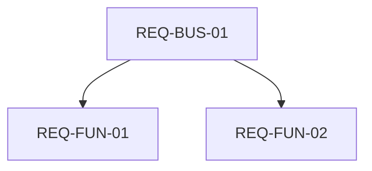

# Скилл: Аудит качества требований (Requirements Quality Audit)

## 🎯 Общее описание
Данный скилл предназначен для автоматической и полуавтоматической верификации спецификаций требований (BRD, SRS, SDD, Roadmap) на соответствие семи золотым инженерным стандартам. Использование скилла избавляет пользователя от необходимости вручную перечислять все параметры и форматировать проверочные матрицы.

---

## 🔍 Семь критериев качества требований

Каждое требование или набор требований должны оцениваться по следующим параметрам:

1. **Completeness (Полнота)**
   * *Вопрос для проверки*: Описаны ли все крайние случаи, входные/выходные данные, форматы и ограничения? Нет ли «белых пятен» и фраз «будет определено позже» (TBD)?
   * *Критерий успешности*: Требования полностью покрывают заявленную область без неописанных состояний.

2. **Traceability (Прослеживаемость)**
   * *Вопрос для проверки*: Есть ли у каждого функционального требования (REQ-FUN) родительское бизнес-требование (REQ-BUS) и соответствующий раздел в архитектурном дизайне (SDD)?
   * *Критерий успешности*: Наличие полной двунаправленной трассировки, визуализированной через Mermaid-диаграмму.

3. **Consistency (Непротиворечивость)**
   * *Вопрос для проверки*: Не противоречат ли требования друг другу (например, требования к скорости работы vs требования к безопасности, локальный оффлайн-режим vs ИИ-генерация)?
   * *Критерий успешности*: Все логические конфликты разрешены через явные приоритеты или разделение на режимы работы.

4. **Unambiguity (Однозначность)**
   * *Вопрос для проверки*: Используются ли точные математические и технические термины вместо субъективных прилагательных («быстрый», «удобный», «безопасный»)?
   * *Критерий успешности*: Все метрики выражены в секундах, процентах, байтах, кодах возврата или четких структурах данных.

5. **Testability (Тестируемость)**
   * *Вопрос для проверки*: Можно ли написать автоматический тест (юнит-тест, интеграционный тест или сквозной тест) для проверки выполнения этого требования?
   * *Критерий успешности*: Требование детерминировано; для него можно четко сформулировать тестовые сценарии ( Given / When / Then).

6. **Feasibility (Реализуемость)**
   * *Вопрос для проверки*: Возможно ли реализовать требование в рамках текущих ограничений бюджета, времени, команды и выбранного технологического стека (Python/Rust/JS)?
   * *Критерий успешности*: Сложные/рискованные фичи вынесены во второстепенные фазы (v2.0+), а MVP строго лаконичен.

7. **Atomicity (Атомарность)**
   * *Вопрос для проверки*: Содержит ли требование только одну неделимую техническую мысль? Не объединено ли несколько функций под одним ID?
   * *Критерий успешности*: Сложные составные требования разбиты на дискретные подтребования со своими уникальными идентификаторами.

---

## ⚙️ Алгоритм работы (Workflow)

Когда пользователь запрашивает аудит требований (например, фразой *«Проверь требования»*, *«Аудит требований»*):

1. **Сбор исходных данных**: Считать целевой файл требований (например, `docs/srs/some_spec.md`).
2. **Покомпонентный анализ**: Проанализировать каждое требование по 7 критериям выше.
3. **Формирование матрицы**: Заполнить матрицу оценки (Evaluation Matrix) в формате Markdown.
4. **Построение карты трассировки**: Сгенерировать Mermaid-граф связей между уровнями требований.
5. **Выработка рекомендаций**: Дать четкие рекомендации по исправлению дефектов (особенно для критериев с оценкой 🟡 или 🔴).

---

## 📄 Шаблон отчета об аудите (Output Template)

Скилл должен генерировать ответ строго в следующем формате:

```markdown
# Отчет об аудите требований: [Название Спецификации]

## 📊 Матрица оценки

| Критерий качества | Оценка | Ключевые выводы и наблюдения |
| :--- | :---: | :--- |
| **Completeness (Полнота)** | 🟢/🟡/🔴 | [Описание] |
| **Traceability (Прослеживаемость)** | 🟢/🟡/🔴 | [Описание] |
| **Consistency (Непротиворечивость)** | 🟢/🟡/🔴 | [Описание] |
| **Unambiguity (Однозначность)** | 🟢/🟡/🔴 | [Описание] |
| **Testability (Тестируемость)** | 🟢/🟡/🔴 | [Описание] |
| **Feasibility (Реализуемость)** | 🟢/🟡/🔴 | [Описание] |
| **Atomicity (Атомарность)** | 🟢/🟡/🔴 | [Описание] |

*Шкала оценок: 🟢 Отлично (соответствует на 100%), 🟡 Требует доработки (есть риски/замечания), 🔴 Критический дефект (блокирует разработку).*

## 🔍 Детальный анализ и рекомендации
* **Замечание 1 ([Критерий])**: Описание проблемы. *Рекомендация*: Как переписать.
* **Замечание 2 ([Критерий])**: Описание проблемы. *Рекомендация*: Как переписать.

## 🗺️ Mermaid-схема связей (Traceability Map)

```

---

## ⚠️ Распространенные ошибки при аудите
* **Субъективность**: Выставление оценки «🟢 Отлично» требованиям, содержащим слова вроде «эффективно» или «интуитивно понятно».
* **Избыточный объем**: Копирование всего текста требований в отчет. Вместо этого нужно ссылаться на ID требований (например, `REQ-FUN-12`).
* **Отсутствие рекомендаций**: Выставление оценки 🟡 или 🔴 без предложения конкретной формулировки для исправления.
