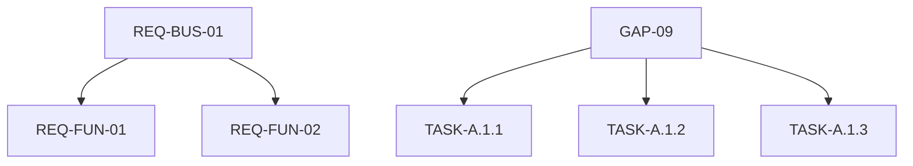

# Skill: Requirements Quality Audit

## 🎯 General Description
This skill is designed for automatic and semi-automatic verification of requirements specifications (BRD, SRS, SDD, Roadmap) for compliance with the seven golden engineering standards. Using this skill eliminates the need for the user to manually list all parameters and format the evaluation matrices.

---

## 🔍 Seven Requirements Quality Criteria

Each requirement or set of requirements must be evaluated against the following parameters:

1. **Completeness**
   * *Review Question*: Are all edge cases, input/output data, formats, and constraints described? Are there any "blind spots" or "to be determined" (TBD) phrases?
   * *Success Criterion*: Requirements completely cover the specified scope with no undescribed states.
   * **Pydantic Model Migration Check** *(applies when auditing v2.0 tasks or specs involving `models.py` changes)*: Verify that each new or renamed model field specifies:
     1. A non-breaking default that prevents `ValidationError` on old serialized IR files (e.g., `Field(default_factory=list)`).
     2. A backward-compat alias (e.g., `ClassEntity = ClassModel`) documented and present in the spec.
     3. A renderer access pattern update — any spec that changes `List[str]` to `List[SomeModel]` MUST name every renderer file and template that accesses that field as a string.
   * *Failure mode to flag*: A requirement that changes a model field type without listing its consumer update sites is INCOMPLETE regardless of other scores.

2. **Traceability**
   * *Review Question*: Does each requirement have an upstream anchor AND a downstream implementation reference? Accept any of the following anchor schemes based on the artifact under review:
     - Legacy SRS: `REQ-BUS-XX` → `REQ-FUN-XX` chain.
     - v2.0 Roadmap / GAP documents: `GAP-XX` → `TASK-<Phase>.<Group>.<Seq>` chain (from `.antigravitycli/v2_detailed_tasks.md`).
     - Hybrid: mixed GAP and REQ-FUN IDs are acceptable ONLY when explicitly cross-referenced.
   * *Success Criterion*: Bidirectional traceability confirmed using whichever ID scheme is native to the target document. Mermaid diagram is OPTIONAL for documents < 20 requirements; MANDATORY for SRS/BRD audits with ≥ 20 requirements.

3. **Consistency**
   * *Review Question*: Do any requirements contradict each other, or is there a mixture of the universal engine's requirements (e.g., what UDE does as a tool) and the project's own dogfooding documentation portal specifics (VitePress/Docusaurus website integration)?
   * *Success Criterion*: All logical conflicts are resolved, and universal engine features are strictly decoupled from project-level dogfooding configurations.

4. **Unambiguity**
   * *Review Question*: Are precise mathematical and technical terms used instead of subjective adjectives ("fast", "user-friendly", "secure")?
   * *Success Criterion*: All metrics are expressed in seconds, percentages, bytes, return codes, or clear data structures.

5. **Testability**
   * *Review Question*: Is it possible to write an automated test (unit, integration, or end-to-end test) to verify compliance with this requirement?
   * *Success Criterion*: The requirement is deterministic; test scenarios (Given / When / Then) can be clearly formulated for it.

6. **Feasibility**
   * *Review Question*: Is it possible to implement the requirement within the current budget, timeline, team capabilities, and selected technology stack (Python/Rust/JS)?
   * *Success Criterion*: Complex/risky features are deferred to secondary phases (v2.0+), and the MVP is strictly concise.

7. **Atomicity**
   * *Review Question*: Does the requirement contain only a single, indivisible technical concept? Are multiple functions combined under a single ID?
   * *Success Criterion*: Complex compound requirements are broken down into discrete sub-requirements with their own unique identifiers.

---

## ⚙️ Workflow

When a user requests a requirements audit (e.g., with the phrase *"Check requirements"*, *"Requirements audit"*):

1. **Collect Input Data**: Read the target requirements file (e.g., `docs/srs/some_spec.md`).
2. **Component Analysis**: Analyze the requirements against the 7 criteria above. For each criterion, a numerical rating must be assigned on a 10-point scale (from 1 to 10).
3. **Formulate the Matrix**: Fill out the Evaluation Matrix in Markdown format, specifying the status (🟢/🟡/🔴) and numerical score (1-10) for each parameter.
4. **Build a Traceability Map** *(conditional)*: If the target document contains ≥ 20 requirements, generate a Mermaid graph of connections between requirement levels. For GAP documents or small specs (< 20 items), skip this step and add a note: "Traceability map omitted — document scope below threshold (< 20 requirements)."
5. **Develop Recommendations**: Provide clear recommendations for fixing defects (especially for criteria with a 🟡 or 🔴 status, or with a score below 7).
6. **Synchronize with Knowledge Base** *(Consent-gated)*: After presenting the audit report in the chat, explicitly ask the user:
   > "Shall I write these findings to `design-docs/docs/srs/quality_audit.md`?"
   Only proceed with the file write upon receiving explicit "yes" or "write it" confirmation. Never auto-write.

---

## 📄 Output Template

The skill must generate the response strictly in the following format:

```markdown
# Requirements Audit Report: [Specification Name]

## 📊 Evaluation Matrix

| Quality Criterion | Status | Score (1-10) | Key Findings and Observations |
| :--- | :---: | :---: | :--- |
| **Completeness** | 🟢/🟡/🔴 | [1-10] | [Description] |
| **Traceability** | 🟢/🟡/🔴 | [1-10] | [Description] |
| **Consistency** | 🟢/🟡/🔴 | [1-10] | [Description] |
| **Unambiguity** | 🟢/🟡/🔴 | [1-10] | [Description] |
| **Testability** | 🟢/🟡/🔴 | [1-10] | [Description] |
| **Feasibility** | 🟢/🟡/🔴 | [1-10] | [Description] |
| **Atomicity** | 🟢/🟡/🔴 | [1-10] | [Description] |

*Status Scale: 🟢 Excellent (100% compliant), 🟡 Requires Revision (minor risks/findings), 🔴 Critical Defect (blocks development).*
*Score Scale: 1 to 10 (where 10 is absolute compliance, 1 is complete lack of compliance). Scores below 7 require mandatory resolution in recommendations.*

## 🔍 Detailed Analysis and Recommendations
* **Observation 1 ([Criterion])**: Problem description. *Recommendation*: How to rewrite it.
* **Observation 2 ([Criterion])**: Problem description. *Recommendation*: How to rewrite it.

## 🗺️ Traceability Map (Mermaid Diagram)

```

---

## ⚠️ Common Audit Pitfalls
* **Subjectivity**: Assigning an "🟢 Excellent / 10 points" score to requirements containing words like "efficiently" or "intuitively".
* **Excessive Volume**: Copying the entire requirements text into the report. Refer to requirement IDs instead (e.g., `REQ-FUN-12`).
* **Lack of Recommendations**: Assigning a 🟡 or 🔴 status (or a score < 7) without offering a specific formulation to fix it.
* **Dogfooding & Scope Confusion**: Mixing requirements for the software engine itself (what UDE must do for *any* input) with requirements for the project's own documentation portal (the website that uses UDE). Specific details like VitePress configurations or UDE's own site-specific file structures must be segregated from the universal engine's functional requirements (SRS).
* **Feasibility on Approved GAP Items**: Do NOT score the Feasibility criterion when auditing v2.0 GAP documents (`future_v2.md`, `v2_detailed_tasks.md`). These items are already approved and scheduled. Mark Feasibility as `N/A` and explain: "Feature is committed to v2.0 — feasibility pre-assessed at roadmap approval stage." Applying a Feasibility score to an approved GAP item is misleading and wastes audit attention on a closed question.
