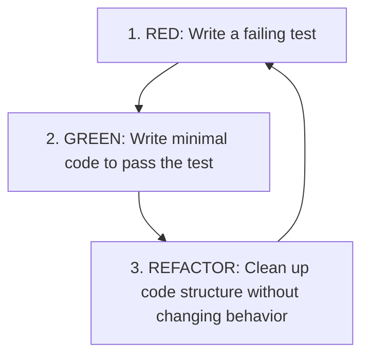

# Testing Methodologies and Styles

This document regulates the approach to testing the UDE codebase and details the rules for applying the selected development methodology.

---

## 🔴 1. Primary Approach: TDD (Test-Driven Development)

**Test-Driven Development (TDD)** is established as the primary methodology for writing and verifying code in the UDE project.

This means that **tests are written before the production code itself**. This approach ensures a clean architecture, minimizes code coupling, and guarantees high test coverage from the very beginning.

### TDD Lifecycle (Red-Green-Refactor):

1.  **Red Phase (RED)**:
    *   The developer writes a test for a new piece of functionality (e.g., parsing a specific comment tag).
    *   The test is executed and **must fail** (or fail to compile), confirming that the verified logic does not exist yet.
2.  **Green Phase (GREEN)**:
    *   The developer writes the **minimal code required** to make the test pass successfully.
    *   Inbound non-optimal or "dirty" code is acceptable at this stage — the primary goal is to pass the test as quickly as possible.
3.  **Refactoring Phase (REFACTOR)**:
    *   The developer refactors the newly written code: removing duplication, isolating abstractions, improving naming and structure.
    *   Tests are run again and must remain green.

---

## 🛠️ 2. Testing Tools

### For Python:
*   Framework: **pytest**.
*   Test Execution Command: `pytest` from the project root or the tests directory.
*   The use of `fixtures` is recommended for preparing test environments (e.g., mocking the filesystem or injecting test configs).

### For TypeScript:
*   Framework: **Jest** (or **Vitest** depending on the final environment configuration).
*   Test Execution Command: `npm test` or `npm run test:watch` (for continuous test restarts in TDD mode).

---

## 📏 3. Rules for Writing Tests

1.  **Test Cleanliness (F.I.R.S.T.)**:
    *   **Fast**: Tests must run within milliseconds. Slow tests disrupt the TDD loop.
    *   **Independent**: Tests must not depend on each other or their execution order.
    *   **Repeatable**: Tests must yield identical results in any environment (local machine, CI/CD).
    *   **Self-Validating**: Tests must automatically report success/failure without requiring manual log analysis.
    *   **Timely**: Tests are written strictly *before* writing production code.
2.  **Test Structure (AAA - Arrange, Act, Assert)**:
    *   `Arrange`: Instantiating objects, preparing input data.
    *   `Act`: Invoking the method under test.
    *   `Assert`: Comparing the obtained result with the expected value.
