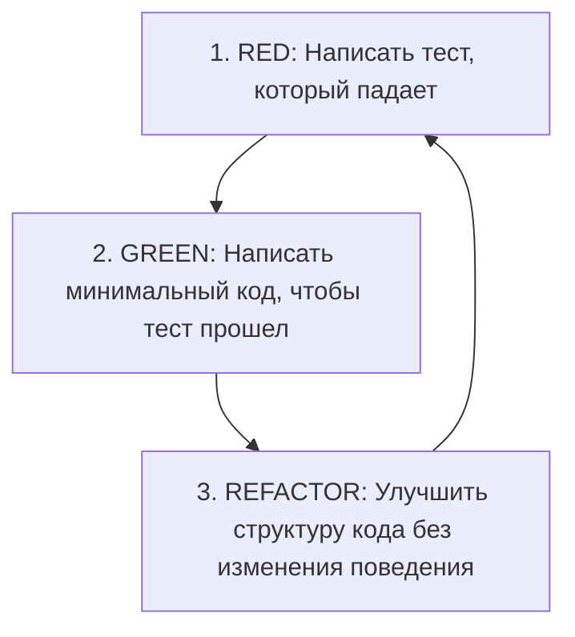

# Методологии и стили тестирования (Testing Style)

Этот документ регламентирует подход к тестированию кодовой базы UDE и детально описывает правила применения выбранной методологии разработки.

---

## 🔴 1. Основной подход: TDD (Test-Driven Development)

Основной методологией написания и проверки кода в проекте UDE утверждена **разработка через тестирование (Test-Driven Development — TDD)**.

Это означает, что **тесты пишутся до написания самого бизнес-кода**. Данный подход позволяет проектировать чистую архитектуру, минимизировать связность кода и гарантировать высокое покрытие тестами с самого начала.

### Жизненный цикл TDD (Red-Green-Refactor):

1.  **Красный этап (RED)**:
    *   Разработчик пишет тест для новой функциональности (например, парсинг специфического тега в комментариях).
    *   Тест запускается и **обязательно должен упасть** (или не скомпилироваться), подтверждая, что проверяемой логики еще нет.
2.  **Зеленый этап (GREEN)**:
    *   Разработчик пишет **минимально необходимый код**, чтобы тест успешно прошел.
    *   На этом этапе допускается неоптимальный или "грязный" код — главная цель максимально быстро пройти тест.
3.  **Этап рефакторинга (REFACTOR)**:
    *   Разработчик проводит рефакторинг только что написанного кода: устраняет дублирование, выделяет абстракции, улучшает именование и структуру.
    *   Тесты запускаются повторно и должны оставаться зелеными.

---

## 🛠️ 2. Инструменты тестирования

### Для Python:
*   Фреймворк: **pytest**.
*   Команда запуска тестов: `pytest` из корня проекта или директории тестов.
*   Рекомендуется использование фикстур (`fixtures`) для подготовки тестового окружения (например, мокирование файловой системы или передача тестовых конфигов).

### Для TypeScript:
*   Фреймворк: **Jest** (или **Vitest** в зависимости от финальной конфигурации окружения).
*   Команда запуска тестов: `npm test` или `npm run test:watch` (для непрерывного перезапуска тестов в режиме TDD).

---

## 📏 3. Правила написания тестов

1.  **Чистота тестов (F.I.R.S.T.)**:
    *   **Fast (Быстрые)**: Тесты должны выполняться за миллисекунды. Медленные тесты ломают цикл TDD.
    *   **Independent (Изолированные)**: Тесты не должны зависеть друг от друга или от порядка их выполнения.
    *   **Repeatable (Повторяемые)**: Тесты должны давать один и тот же результат в любой среде (на локальной машине, в CI/CD).
    *   **Self-Validating (Самопроверяемые)**: Тест должен автоматически выдавать результат (успешно/упал) без необходимости ручного анализа логов.
    *   **Timely (Своевременные)**: Тесты пишутся строго *до* написания продакшн-кода.
2.  **Структурирование теста (AAA - Arrange, Act, Assert)**:
    *   `Arrange` (Подготовка): инициализация объектов, подготовка входных данных.
    *   `Act` (Действие): вызов тестируемого метода.
    *   `Assert` (Проверка): сопоставление полученного результата с ожидаемым.
