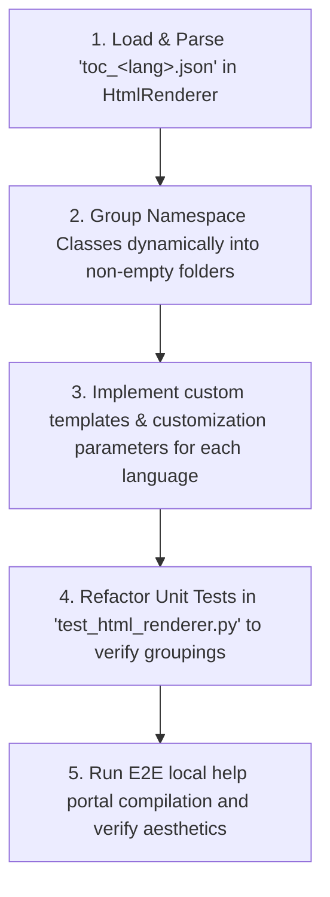

# MVP v1.1 Implementation Plan: Dynamic JSON-Based Sidebar & Language-Specific Entity Layouts

This plan details the development steps, task definitions, and verification scenarios to implement the upgraded requirements for dynamic language-specific sidebars (**`REQ-FUN-35`**) and custom, language-specific entity help page layouts (**`REQ-FUN-32`**).

---

## 🛠️ Objectives & Task Definitions

| Requirement ID | Type | Feature | Technical Objective |
| :--- | :---: | :--- | :--- |
| **`REQ-FUN-35`** | 🔄 Upgrade | **Dynamic ToC Grouping via JSON Rules** | Load language-specific `toc_<lang>.json` config files at runtime. Parse and group namespaces and classes into virtual folders (e.g., *Classes*, *Structures*, *Interfaces*) according to loaded rules, while strictly omitting empty folders to ensure zero empty/dead links. |
| **`REQ-FUN-32`** | 🔄 Upgrade | **Language-Specific Entity Help Layouts** | Guarantee that reference help pages strictly conform to unique templates and syntactic conventions tailored for each target language (C++, C#, Java, Python) in terms of scope delimiters, signature styling, and member grouping. |
| **`REQ-FUN-31`** | 🔄 Upgrade | **Active Node Focus & Scrolling** | Implement active navigation item auto-focus and vertical scrolling on page load for both offline HTML (`sidebar.js`) and Hugo templates (`single.html`). Parent folders of the active node must be auto-expanded, and the scrolling container must align the active item to the top of the visible viewport. |

---

## 📅 Chronological Step-by-Step Implementation



### 📍 Step 1: Dynamic Configuration Loading in `HtmlRenderer`
*   In `engine/ude/renderers/static_html.py`, resolve the path to the language-specific JSON spec file:
    ```python
    toc_lang = "cpp" if self.language == "cpp" else "cs" if self.language == "csharp" else "java" if self.language == "java" else "py"
    json_path = templates_dir / "SidebarStructures" / "default" / f"toc_{toc_lang}.json"
    ```
*   Load the JSON file and extract `virtual_group_folders` (such as `namespace_level` / `package_level`).

### 📍 Step 2: Dynamic ToC Sorting with Empty Folders Pruning (`REQ-FUN-35`)
*   Group entities in each namespace into virtual category lists (e.g., `Classes`, `Structures`/`Structs_and_Enums`, `Interfaces`) based on `cls.entity_type`.
*   Iterate through the specified language's virtual folder order (defined in the JSON file).
*   If a category is non-empty, create a virtual container node in `nav_data.js` (with a blank `url` or `""` and `type: "group"`). If a category has zero members, **prune it entirely** to satisfy the "no empty folders" rule.
*   Add the actual entities as child leaf nodes underneath their respective virtual folder.

### 📍 Step 3: Standardized, Language-Specific Entity help layouts (`REQ-FUN-32`)
*   Refactor the HTML help pages generator to load/apply specific styling and syntax delimiters depending on `self.language` (e.g. `::` vs `.`, specific template parameters escaping, OOP prototypes).
*   Ensure that distinct, custom templates (or customizable parameters) are applied per language to guarantee full native visual alignment with language-specific conventions.

### 📍 Step 4: Test Suite Refactoring (TDD Verification)
*   Modify `test_html_renderer.py` to expect the new nested group hierarchy under namespace nodes in `nav_data.js` (e.g. `Root` ➡️ `Namespace` ➡️ `Classes` / `Structures` ➡️ `Class Leaf`).
*   Assert that empty folders are correctly excluded.
*   Verify code coverage remains strictly `>= 98%`.

### 📍 Step 5: Active Node Auto-Focus & Top-Scrolling Implementation (`REQ-FUN-31`)
*   **Offline HTML (`sidebar.js`)**: Add scroll logic inside DOMContentLoaded after building and appending the tree. Compute offset of the `.OdaDocTOCRow.active` recursively relative to `#toctree` and assign it to `toctree.scrollTop`.
*   **Hugo Layout (`single.html`)**: Add identical scroll logic inside the DOMContentLoaded script. Locate the `.api-item.active` node, ensure its parent `.namespace-group` is expanded (uncollapsed), recursively compute its offset relative to `.left-sidebar`, and set `.left-sidebar.scrollTop = offset`.

---

## 👥 Quality Gates & Verification Criteria

1.  **Strict JSON Compliance**: The generated sidebar hierarchy reflects the exact virtual groupings specified in the respective `toc_<lang>.json` rules.
2.  **No Dead/Empty Nodes**: Clicking a collapsible group header expands/collapses it, and no folder is created unless it contains at least one active page node underneath.
3.  **Template Layout Look & Feel**: API help reference layouts dynamically format method signatures, scopes, and prototypes to natively match the target programming language.
4.  **Active Node Auto-Focus & Top Alignment**: Upon loading any documentation page (both standalone HTML and Hugo-compiled), the sidebar must automatically scroll to focus on the active page node and display it at the top of the sidebar viewport, with parent containers expanded.
